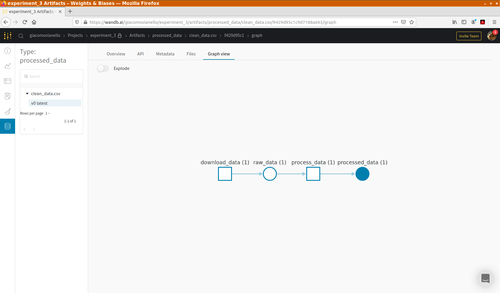

# Instructions
In this exercise we will build our first MLflow pipeline by connecting two components.

The starter kit contains two already-built components, one that downloads the data (from the
previous exercise), and one that performs some data processing: it creates and visualize 
a t-SNE projection with 2 components, then saves the dataframe with the t-SNE components 
added as columns. 

The starter kit also contains a stub of a ``main.py`` file that you will need to complete.

Your task is to stitch these two components together in a pipeline.

## Steps

1. Complete the ``conda.yml`` file. The pipeline main script needs the conda packages:
     * requests=2.24.0
     * pip=20.3.3
     * mlflow=1.14.1
     * hydra-core=1.0.6
     * pip=20.3.3
   
   as well as the ``pip`` package:
     * wandb==0.10.21

2. Complete ``main.py`` by adding the process_data step (instructions in the file)

3. Run the pipeline using ``mlflow run .`` in the directory of the ``main.py`` file

4. Re-run the pipeline changing the name of the experiment from the command line:
   ```bash
   mlflow run . -P hydra_options="main.experiment_name=prod"
   ```

5. Go to W&B, in the artifact section, pick an artifact then click on Graph view. You will see
   your first pipeline as:
   