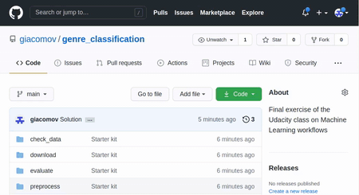

# Instructions
In this exercise you will release your final pipeline as a versioned code artifact on GitHub.

# Steps

1. Go to the repository we created in Exercise 14, which contains your solution to that exercise.
   Make sure you have committed and pushed the solution.
   
2. Make sure that the ``config.yaml`` file contains the final parameters for the model that we
   have chosen (``max_depth: 13`` and ``max_features: 10``). If not, change that, commit and push.
   
3. Go to Github and make a release with version ``1.0.0``:
   

4. Now anybody can use your pipeline at version 1.0.0 with mlflow and w&b:
   ```bash
   mlflow run -v 1.0.0 [URL of your Github repo]
   ```

   > NOTE: anyone using the pipeline need to be logged in to ``wandb`` (``wandb login``)
